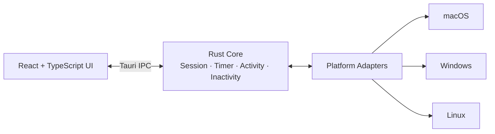

<div align="center">


</div>

Awake is a minimal, local-first desktop utility that keeps your computer awake for a configured session. It monitors inactivity and can optionally simulate desktop activity, with no account, no backend, and no telemetry.

It is built for the long, hands-off situations every developer runs into: model training, software builds, large downloads, renders, remote jobs, or a presentation you do not want to babysit. You start a session, and everything else works around it.

## Features

- **Session-based.** Pick a duration, start it, and watch it count down. Extend it by 30 minutes or 1 hour without starting over.
- **Keeps your system awake**, and independently, **your display awake**, using real OS-level power management, not a simulated mouse jiggle.
- **Detects inactivity** with a configurable threshold, using the same OS APIs the system itself relies on. No keylogging, no input hooks.
- **Optional activity automation.** Simulated mouse movement, clicks, keyboard taps, and scroll gestures fire at randomized intervals, so it never looks like a fixed-period timer. Mouse movement traces a short path instead of teleporting the cursor.
- **Pauses automatically.** Real input always takes priority, and any pending automated action is cancelled the moment you touch the mouse or keyboard.
- **Stops instantly.** One click, one tray action, or a configurable global shortcut kills automation immediately.
- **Reusable activity profiles.** Developer, Presentation, and Testing ship built in. Create your own, and import or export custom profiles as JSON.
- **Session templates.** Save a duration and settings combo from the setup screen, then reload it with one click.
- **Launch at login**, off by default.
- **Lives in your tray**, not your dock or taskbar. Closing the window keeps it running.
- **Excludes itself from screen capture**, where the OS supports it.
- **Local-first privacy.** No account, no backend, no telemetry. Settings, profiles, and an optional local session history all live in a single JSON file on your machine.

## Architecture

Awake follows a hexagonal, ports-and-adapters design. The Rust core holds all platform-agnostic logic, and a thin adapter layer implements it per operating system.



The core never talks to the operating system directly. It defines small trait boundaries such as power management, idle detection, and input simulation, and each platform adapter implements them using native APIs. See [docs/architecture.md](docs/architecture.md) for the full design rationale.

## Supported Platforms

| Platform    | Status                                                    |
| ----------- | --------------------------------------------------------- |
| macOS 11+   | First-class                                               |
| Windows 10+ | First-class                                               |
| Linux (X11) | Experimental, see [Known Limitations](#known-limitations) |

## Installation

Pre-built installers are not published yet. You have two options:

- **Build it yourself.** See [Development Setup](#development-setup). Tauri does not support cross-compiling installers, so build on the OS you want an installer for.
- **Build it in CI.** Run the `Build Installers` workflow from this repo's Actions tab (works on demand, no tag required) and download the installer for each OS from the run's artifacts. Pushing a `v*` tag runs the same workflow.

Once installers are attached to a [GitHub Release](../../releases):

- **macOS**: download the `.dmg` and drag Awake to Applications.
- **Windows**: download the `.msi` or `.exe` installer and run it.
- **Linux**: download the `.AppImage`, or the `.deb` on Debian and Ubuntu-based distros.

## Permissions

Awake only asks for what it needs, and only when a feature that needs it is actually turned on.

| Permission                                   | Why                                                                                   | When it is requested                   |
| -------------------------------------------- | ------------------------------------------------------------------------------------- | -------------------------------------- |
| Accessibility (macOS)                        | Simulating mouse and keyboard input for activity automation                           | Only if you enable Activity Automation |
| Input Monitoring-adjacent APIs (Windows)     | Same, via `SendInput`-equivalent APIs                                                 | Same                                   |
| None, for power management or idle detection | These use read-only or assertion APIs that need no special permission on any platform | N/A                                    |

Awake never asks for Accessibility or input permissions just to start a plain "keep the system awake" session. Only activity automation needs it. See [docs/permissions.md](docs/permissions.md) for the full platform-by-platform breakdown.

## Development Setup

**Prerequisites:** [Rust](https://rustup.rs) (stable), [Node.js](https://nodejs.org) 20+, [pnpm](https://pnpm.io) 9+, and the [Tauri prerequisites](https://v2.tauri.app/start/prerequisites/) for your OS (Xcode Command Line Tools on macOS, WebView2 on Windows, `webkit2gtk` and friends on Linux).

```bash
git clone https://github.com/Muhammad-Jawad-Hassan/AWAKE-DESKTOP.git
cd AWAKE-DESKTOP
pnpm install
pnpm tauri dev
```

This starts the Vite dev server and launches the app with hot reload for the frontend and incremental `cargo` builds for the backend.

### Useful Commands

```bash
pnpm dev            # frontend only, in a browser, no Tauri window
pnpm tauri dev       # full app with hot reload
pnpm build           # typecheck and build the frontend
pnpm test            # frontend unit tests (vitest)
pnpm lint            # eslint
pnpm typecheck       # tsc --noEmit
pnpm format          # prettier --write

cd src-tauri
cargo test                          # Rust unit tests (core domain logic)
cargo clippy --all-targets -- -D warnings
cargo fmt
```

## Build Instructions

```bash
pnpm tauri build
```

This produces a platform-native installer in `src-tauri/target/release/bundle/`. Tauri does not support cross-compiling installers, so build on each target OS, or use the CI matrix in `.github/workflows/` as a reference for automated builds.

## Privacy Policy

Awake follows a local-first model.

- No user accounts, no backend server, no cloud storage, and no remote telemetry or analytics.
- Configuration and profiles are stored in a single JSON file in your OS's standard app-config directory.
- Local activity statistics, such as session, active, and inactive duration, and automated event counts, are **off by default**. When enabled, they never record _what_ you typed or clicked, only _that_ input occurred.
- Nothing is ever transmitted anywhere. Everything Awake does happens on your machine.

See [docs/privacy.md](docs/privacy.md) for details.

## Known Limitations

- **Linux support is experimental.** Power management needs `systemd-inhibit`. Idle detection needs `xprintidle` and X11. Wayland has no standard, unprivileged way to query idle time or simulate input system-wide, so both capabilities report as unsupported there instead of failing silently.
- **Screen-capture exclusion is not universal.** It uses legitimate, OS-supported APIs (`NSWindow.sharingType` on macOS, `SetWindowDisplayAffinity` on Windows), but it does not work with every recording method or third-party capture tool, and is not available on Linux at all.
- **Activity automation needs a permission grant** (Accessibility on macOS) to actually move the mouse or send keystrokes. Without it, the feature is visibly disabled rather than silently failing.

See [docs/limitations.md](docs/limitations.md) for the complete list.

## Contributing

Contributions are welcome. See [CONTRIBUTING.md](CONTRIBUTING.md) for how to get set up, the coding conventions this repo follows, and how to submit a change. Please also read the [Code of Conduct](CODE_OF_CONDUCT.md).

Found a security issue? Please follow [SECURITY.md](SECURITY.md) instead of opening a public issue.

## License

[MIT](LICENSE) © 2026 Muhammad Jawad Hassan
